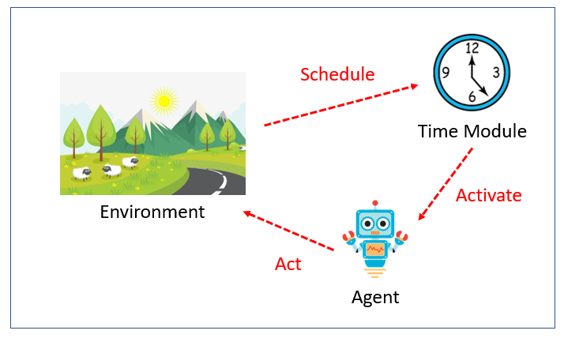

# MATLAB -- A Multi-Agent Framework
The present project was based on the Mesa Python Project: https://mesa.readthedocs.io/en/latest/index.html

It is composed of three main modules: model, agent and time module.

The model module represents the environment and encapsulates both the agent and the time modules.

The agent module determines the agents' behaviour.

The time module, in turn, is reponsible for the scheduling and activation of agents.

[]

The example herein used is the Random Wealth Game (https://github.com/eduardogfma/RandomWealthGame): a game where each agent starts with a coin and in each step it has to randomly choose and give away a coin.
